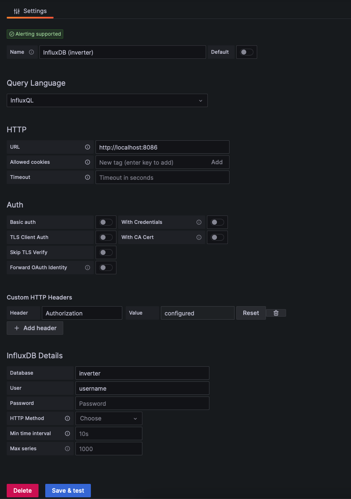
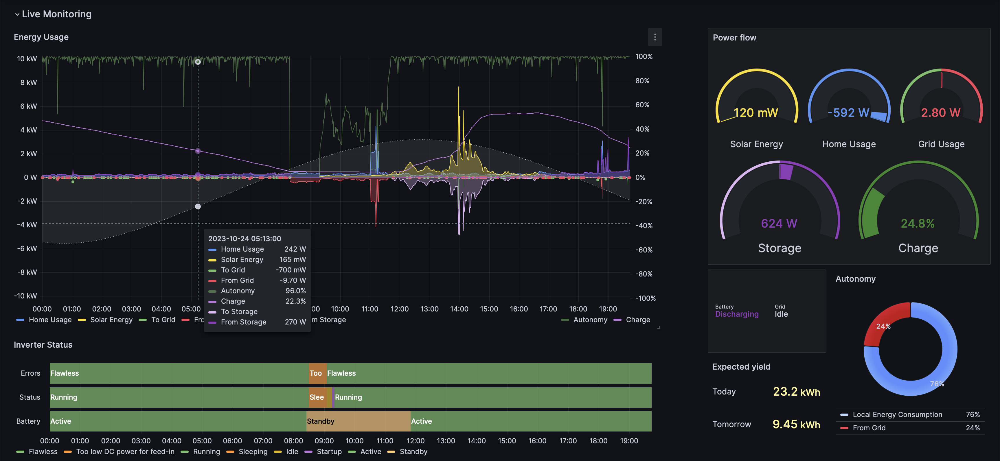
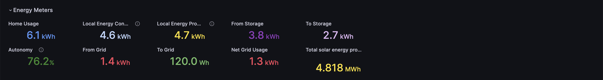
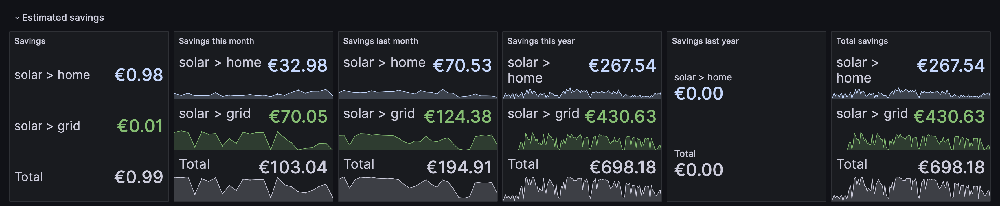
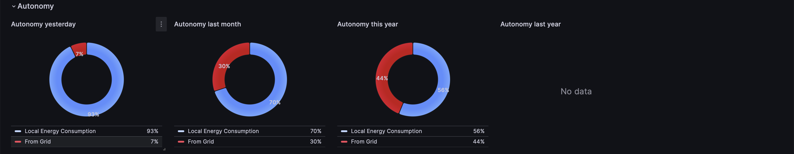
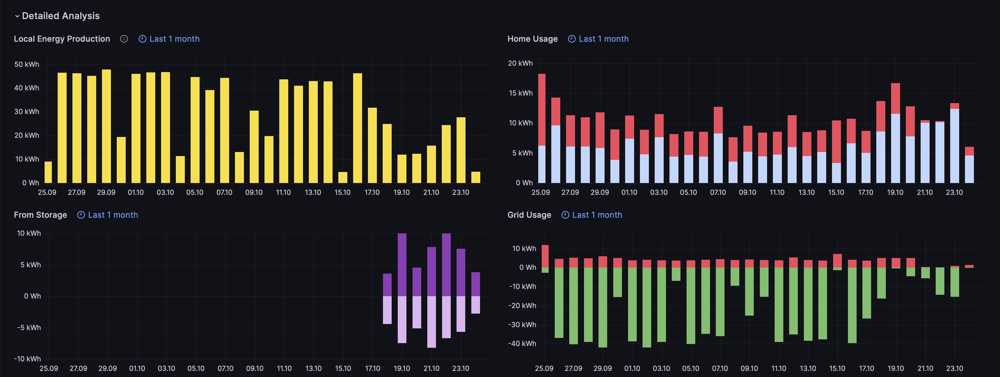
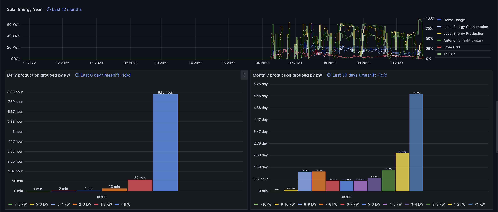
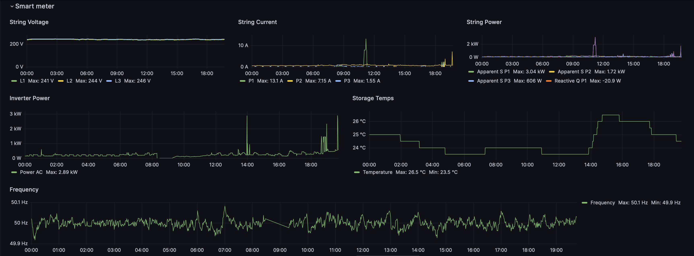
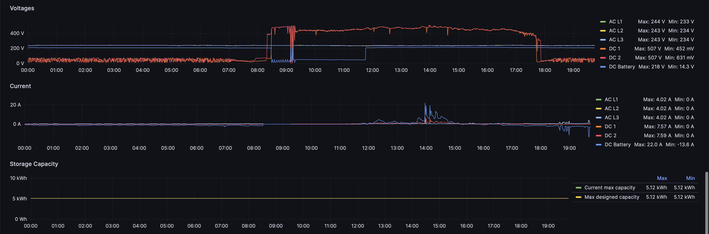

# Data Visualization for Fronius

This README provides information on setting up and visualizing data from your Fronius Symo GEN24 10.0 inverter and Smart Meter TS 65A-3 using InfluxDB and Grafana.

## Fronius Setup

- **Inverter**: Symo GEN24 10.0
  - Fronius JSON API (v1) enabled. For more details, refer to the [Fronius Solar API documentation](https://www.fronius.com/en/solar-energy/installers-partners/technical-data/all-products/system-monitoring/open-interfaces/fronius-solar-api-json-).
- **Smart Meter**: TS 65A-3
  - Meter Location: 0 - Grid Interconnection Point (Primary Meter)
- **Storage**: BYD HVS 5.1

> **_NOTE:_** All Grafana configurations related to minimum and maximum values align with this setup.

## Telegraf, Influx and Grafana Installation

To set up the TIG (Telegraf, InfluxDB, and Grafana) stack, please follow any how-to guide you find, such as [this search](https://duckduckgo.com/?t=h_&q=setup+tig+stack&ia=web).

## Influx

The following buckets have been created in InfluxDB:

- inverter
- pvforecast
- energyprices

### Data Import

Telegraf is utilized for importing data from the Fronius JSON API and forecast data from [forecast.solar](https://forecast.solar). The full configuration can be found in [telegraf.conf](telegraf/telegraf.conf).

#### Energy Data

Please adapt the configuration for InfluxDB output to your needs:
```toml
[[outputs.influxdb_v2]]
    urls = ["http://127.0.0.1:8086"]
    token = "change_me"
    organization = "default"
```
> **_NOTE:_** The IP Address of the Symo GEN24 10.0 is in my network resolved by hostname `inverter`. Either you configure your network the same way or change the IP address in the configuration.

#### Forecast

Additionally, please make sure to adapt the links to the [api.forecast.solar](https://api.forecast.solar) in the configuration file as there are currently only placeholders. In the dashboard, the only displayed metric is `Watt hours per day`, presented as `Expected yield`.

For more information about using the API, you can refer to the following documentation:
- [API Documentation for Estimations](https://doc.forecast.solar/api:estimate)
- [Finding Your Azimuth](https://doc.forecast.solar/find_your_azimuth)

These links should provide you with the necessary details to configure and utilize the forecast data effectively in your setup.

#### Energy Prices

Energy prices need to be available to calculate savings. Please note that the accuracy of prices in queries is limited to daily updates. Prices are imported via CSV using the InfluxDB load data feature. The CSV file content should adhere to the specified format:

```csv
#group,false,false,true,true,false,false,true,true,true
#datatype,string,long,dateTime:RFC3339,dateTime:RFC3339,dateTime:RFC3339,double,string,string,string
#default,mean,,,,,,,,
,result,table,_start,_stop,_time,_value,_field,_measurement,unit
,,0,2023-04-01T00:00:00+02:00,2023-04-01T00:00:00+02:00,2023-04-01T00:00:00+02:00,14.457,sell,electricity,Cent/kWh
,,0,2023-07-01T00:00:00+02:00,2023-07-01T00:00:00+02:00,2023-07-01T00:00:00+02:00,13.691,sell,electricity,Cent/kWh
,,0,2021-10-02T00:00:00+02:00,2021-10-02T00:00:00+02:00,2021-10-02T00:00:00+02:00,21.211,buy,electricity,Cent/kWh
```

## Grafana

### Plugins

The following Grafana plugins need to be installed:

- [JSON API by Marcus Olsson](https://github.com/grafana/grafana-json-datasource)
- [Sun and Moon by fetzerch](https://github.com/fetzerch/grafana-sunandmoon-datasource)

### Data Sources

The following data sources need to be configured:

#### InfluxDB
- InfluxDB to the `energyprices` bucket
- InfluxDB to the `inverter` bucket
- InfluxDB to the `pvforecast` bucket

> **_NOTE:_** The Query Language needs to be set to `InfluxQL`



> **_NOTE:_** To authorize access, use the `Authorization` header with the value `Token YOUR_TOKEN`. Replace `YOUR_TOKEN` with the token generated for InfluxDB access ([InfluxDB v2 API documentation](https://docs.influxdata.com/influxdb/v2/api/#section/Authentication/TokenAuthentication)).

#### Other
- JSON API to your inverter with the endpoint [/status/powerflow](http://inverter/status/powerflow)
- Sun and Moon for your latitude and longitude

> **_NOTE:_** The IP Address of the Symo GEN24 10.0 is in my network resolved by hostname `inverter`. Either you configure your network the same way or change the IP address in the JSON API datasource accordingly.

### Dashboard

After the basic configuration is done, the dashboard can be imported from the [dashboard.json file](grafana/dashboard.json).

To import the dashboard, download the file and follow these steps:

1. Go to Grafana.
2. Navigate to Dashboards > New > Import.
3. Upload the downloaded file.

By default, the dashboard shows the current day and is refreshed every 5 seconds. The short refresh time was selected because the `Power flow` panel uses JSON API to show the most recent values and is not restricted to a time interval of data in InfluxDB.

### Screenshots

Here are some screenshots of the dashboard:

#### Live Monitoring


#### Energy Meters


#### Estimated Savings


#### Autonomy


#### Detailed Analyses



#### Smart Meter



## Credits

### Grafana
- [Grafana](https://github.com/grafana/grafana)

#### Based on Work Of
- [Powerwall Dashboard by jasonacox](https://github.com/jasonacox/Powerwall-Dashboard)

### Telegraf and Influx
- [Telegraf](https://github.com/influxdata/telegraf)
- [InfluxDB](https://github.com/influxdata/influxdb)

#### Based on Work Of
- [Fronius-to-Influx by szymi-](https://github.com/szymi-/fronius-to-influx)
- [Solar Panel Monitoring with Telegraf](https://gist.github.com/farmio/618ca3c1b3f335dd966b19a92acef832)
- [How I Created a Telegraf Plugin to Monitor Solar Panels](https://thenewstack.io/how-i-created-a-telegraf-plugin-to-monitor-solar-panels/)

### Readme Improvements
Readme improved by ChatGPT: I've cleaned up the formatting and made sure headings, lists, code blocks, and links are properly formatted for clarity.
